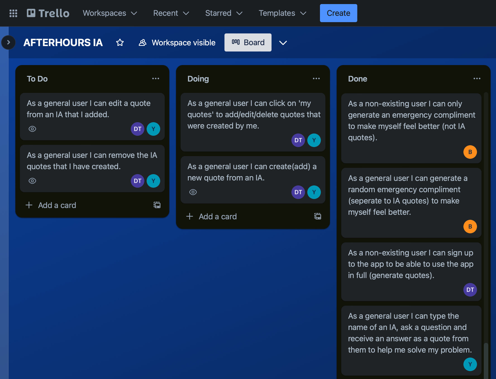
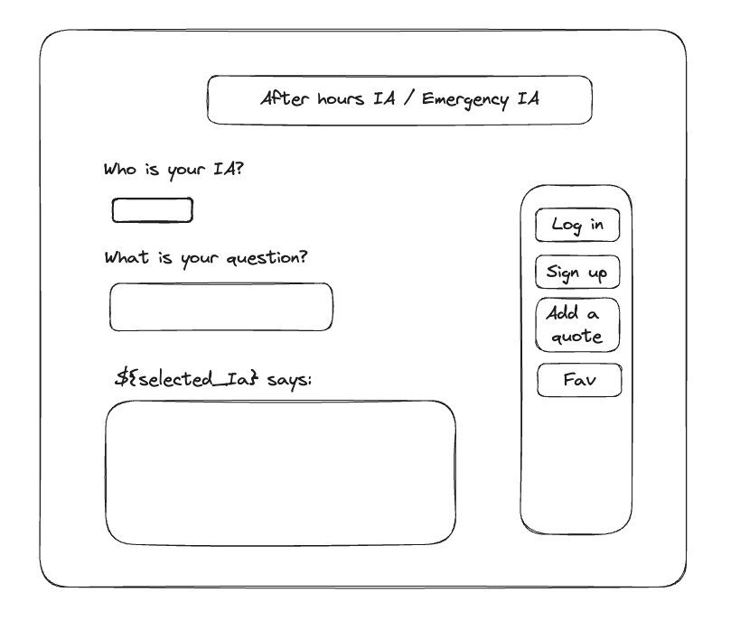

# AFTER HOURS IA :shipit:
Our first group project! Julia, Dale, Ben built a helper tool for students - get help from your favourite IA, even when they are not around! Or if you simply need a nice little uplifting compliment, we have you covered.

## :computer: [Click here](https://after-hours-ia.onrender.com/) to try our app!

## :page_facing_up: About
**How to use the app:**
1. If you haven't signed up yet you'll only be able to generate an uplifting copmpliment if you are feeling down.
1. If you wanna ask a question to one of the IAs then sign up to the app!
2. After you sign up you can log in, and go to the page "Ask IA" to ask your question to anyone or to an IA of your choice.
3. A random quote from the IA(s) will be generated as an answer to your question.
4. You can visit 'My Quotes' page to add a new quote, edit or delete the quotes that you've created.
5. You can also generate a random compliment in case you are feeling down.

## :pencil2: Planning & Problem Solving
The work on this project commenced with a detailed plan on how we want our app to look, what functionality it will have and what tools we need to set up to get started with it.

First, the functionality of the app was written in the form of user stories that were later used in the Trello app to assign responsibilites and tasks amongs the members of the group. 

- Gaining experience working as a group, learning how to work together efficiently and not overlap.
- 

## :rocket: Cool tech
- Coding languages: HTML, CSS, JavaScript.
- Web framework: Express.
- Database related tech: Postgresql, CRUD, RESTful routes.
- Code editor: Visual Studio Code.
- Deployment: Render.
- Libraries: Animate.css, Bootstrap(to style the buttons).
- Animation: 
- All the passwords are securely stored through bcrypt hashing and salthing.

## :scream: Bugs to fix :poop:
- When a user doesn't write anything inside the question field on the 'Ask IA' page they can still generate a quote from them.
- The state variable can be used to access users' accounts without needing to log in: by chnaging the variable's keys through the console on the webpage.
- App is not adjusted for screens of different sizes, e.g. the mobile interface.

## :sob: Lessons learnt
- Frequent and succinct git commits assist in telling a clear story. 
- Avoiding convoluted and repetitive code especially when working as a part of a team.
- Making notes on each part of the code even if everyone thinks they know what it does. The goal is to make sure we all have the same understanding.
- Always create a new repo branch when working on a new feature or fixing a bug.
- Always delete the branch once the feature is finished to avoid having different branches and getting confused in them.
- When debugging change very small parts of the code, even if it's one line, then console.log it to see if it's changed anything.

## :white_check_mark: Future features
- A general user can favourite a quote from an IA to view a list of quotes that they liked.
- A general user can report a quote that they find offensive.
- A general user can ask a question to anyone and then they can guess which IA said the random quote that pops up as an answer to their question.